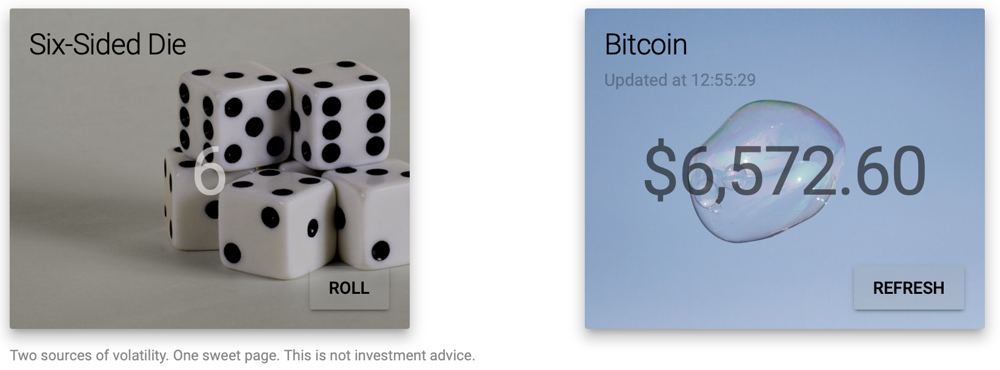

# Volatility

Volatility is a single-page web application, that displays the current value of
Bitcoin alongside the face of a six-sided die.

This was my “learn [Elm](http://elm-lang.org)” project, developed during the
height of the [Bitcoin craze](https://en.wikipedia.org/wiki/Bitcoin#2017–2018).

## Develop

1. Install [Elm Platform](https://guide.elm-lang.org/install.html). On macOS with Homebrew: `cask install elm-platform`.
2. `elm-reactor`
3. Visit <http://localhost:8000/src/Main.elm>

For live reload:

1. `yarn global add elm elm-live`
2. `elm-live src/Main.elm`
3. Visit <http://localhost:8000>

## Deploy

`elm make src/Main.elm --output index.html`

## Credits

* Blockchain info is from the [Blockchain.info API](https://blockchain.info/api).
* The “dice” image is from vicki4net@pixabay <https://pixabay.com/en/games-die-dice-spot-dot-cube-1693114/>
* The “soap bubble” image is from <http://maxpixel.freegreatpicture.com/Ease-Float-Background-Soap-Bubbles-Blow-Fly-Water-2670288>

## License

MIT
